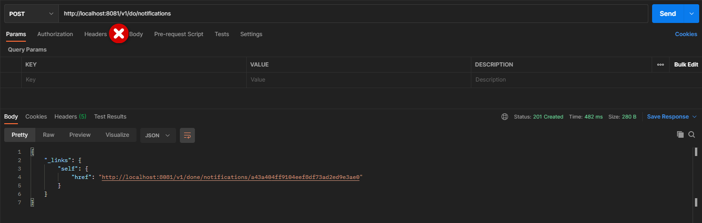

    

    
    
    
    

# About
Study about [Spring Cloud Sleuth](https://spring.io/projects/spring-cloud-sleuth) and [Zipkin](https://zipkin.io/pages/quickstart.html)

# Building
- You need clone this repository `$ git clone git@github.com:samuel-cruz/spring-sleuth.git`
- Run zipkin from a docker `$ docker run -itd --name trace -p 9411:9411 openzipkin/zipkin`
- Proxy server
  - `$ cd proxy`
  - `$ gradle bootRun`
- Notification server
  - `$ cd notification`
  - `$ gradle bootRun`

# Request
You can generate the requests using curl or Postman, as shown below.
- `curl --location --request POST 'http://localhost:8081/v1/do/notifications'`
- `curl --location --request GET 'http://localhost:8081/v1/done/notifications'`

or

  
  

  

# Monitoring logs
- Open Zipkin in your browser `http://localhost:9411/zipkin`

  
  

  
  

  

    
  Made with 🧡 by <a href="https://samuel-cruz.github.io/" target="_blank">Samuel Cruz</a>

